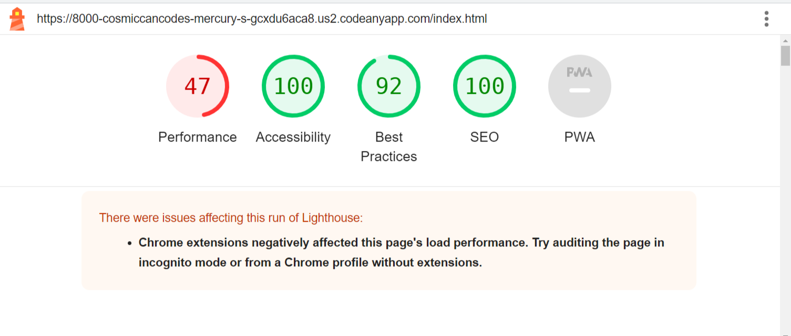
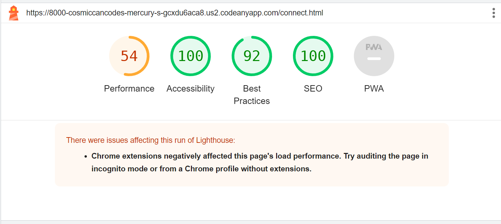

# Mercury Solutions

- [Introduction](#introduction)
- [Strategy](#strategy)
- [Scope](#scope)
- [Structure](#structure)
- [Skeleton](#skeleton)
- [Design](#design)
- [Surface](#surface)
- [Credits](#credits)

## Introduction 

This project was sparked by the insights of Astrologers like Dr. Christof Niederwieser and Andre Barbault. With the world advancing into the 'Age of Air,' where technology surges and ancient wisdom resurfaces, I found myself combining my passion for coding and astrology.

Astrologers like Dr. Niederwieser predicted significant events, including the pandemic, years in advance. Astrology's track record in forecasting everything from wars to market trends intrigued me. So, I decided to bridge the esoteric world of astrology with practical business insights.

The idea is simple: offer a B2B service that combines the insights of major celestial bodies—Jupiter to Pluto—with hard data. The company synthesizes this into understandable narratives that help businesses expand, manage employees better, devise unique strategies, and boost profits. It's about applying ancient wisdom to modern challenges.

# **Strategy:** 

A B2B website. The primary goal of the website is to inform the visitor that this is a legitimate Data Analytics service, as well as educate potential customers of the potent insights astrology can provide. It is very important to show credibility, as well as reliability, with B2B businesses. They need to know why and how their business will gain more insight into their area of choice with this service, and not be alienated by the esoteric image astrology has in the west.

***Site owner wants to:***

- Build Awareness on a unique niche to create curiosity and intrigue

- Build Brand Awareness

- Show how astrology-based insights can help make strategic decisions for their business. (build teams, enhance marketing strategies, aim to improve employee satisfaction and productivity).

- Show credentials of client to ensure authority in this field

- To create contact with the potential customer through a consulation call / meeting, to create a business partnership

***Potential Clients are:***

- Content Creators, HR-Managers in Retail/Tech, Financial Analysts, Small Business Owners and Coaches.

 ***These ideally posess these qualities :***

- A culture of research and experimentation, a holistic approach,
   long-term planing outlook on longevity. As well as the budget.

***User Stories***

*Overall as a potential B2B Client, I wish to explore how the data analyst's astrology-based insights can enhance my business's decision-making processes and services.*  
  
*Marketing Manager: I want to incorporate astrological insights into my marketing strategies to improve the effectiveness of promotions.*

*Financial Analyst: I want to explore how previously unknown trends can potentially impact financial markets, helping me make informed investment decisions.*

*Small business owner: I'm curious to understand how these insights can help me make better decisions for my business, such as the best times to launch new products or service.*

*HR Manager: I'm interested in collaborating with the data analyst to explore better personality assessments for hiring and team-building purposes, aiming to improve employee satisfaction and productivity.*

*Content creator: I'm intrigued by the idea of leveraging astrology data to create more engaging and personalized content for my audience.*

*Health and wellness coach: I want to partner with the data analyst to incorporate astrology insights into my coaching programs, offering clients a unique and holistic approach to personal development.*

## Scope 

### In Scope

- Clean, concise, and simple design that conveys professionalism and
   competence in both Astrology and Data
- Homepage with a compelling story as to *why we are special*
- Functional links and navigation
- A „Review" section
- An „About" section
- A section that further explains how astrology works (namely the Big 5) and Data Analytics /Big Data in compelling manner  
- A form to book a call or get in touch
- High-quality images

### Out of Scope

- One Pager
- Chat-section
- Login/User Account
- A credentials Section with Skillsets in Languages and Astrological Education

## Structure 

### All Pages

- Functional Navigation to all Pages of the Website
- Footer to social media platforms
  
### Homepage

- Hero Image with an Introduction Section to Big Data and Astrology
- Call to Action and Form
- A „Big Data and Big 5“ Section where the Philosophy and approach of Mercury Analytics is being explained, and a short explanation of the Big 5 Planets with images

### Review-Page

- Reviews of past customers with images, names and experiences
  
### About Page

- Functional form containing fields with requirements for: name, email, phone, choice of service, and a field for the customer to describe their inquiry, with a sending button.
- Further explanation of how Mercury Analytics works to create more hype and trust

## Skeleton 

I had a mental idea of what I wanted to produce on screen.

## Surface 

As a B2B and B2C hybrid site, it was important to me to create a mainly simple and aesthetically pleasing website that invited the reader to indulge in the intriguing blend of two themes that usually don't go well together.

### Design 

#### Color Palette

- ##### Main Color Theme: Green
  - I chose green as the primary color theme for this website to symbolize Mercury, the planet associated with Analytics and Astrology, aligning with the core themes of the project.

- ##### Background Color: Neutral with Opacity
  - The background color is a neutral shade with opacity, rgba(238, 238, 238, 0.75), offering a subtle backdrop that doesn't distract from the content.

- ##### Nav and Footer Background Colors:
  - Larger screens: rgb(24, 61, 61)
  - Smaller screens with dropdown menus: rgb(201, 247, 230)
  - The use of different background colors ensures a responsive and visually appealing experience for users.

- ##### Footer Favicons:
  - The footer favicons are styled with the color blanchedalmond, which contrasts effectively with the green theme and adds a touch of uniqueness to the design.

- ##### Link Colors:
  - For dark backgrounds: rgb(201, 247, 230)
  - For light backgrounds: rgb(24, 61, 61)
  - These link colors provide clear visibility and consistency in design across different sections of the website.

- ##### Call to Action Button Color:
  - The Call to Action Button is styled with the color rgb(199, 238, 223), making it visually prominent and encouraging user interaction.

- ##### Active Color:
  - An active color of rgb(201, 247, 230) is used to emphasize interactive elements and provide visual feedback to users.

---

The color palette carefully chosen for this website combines symbolism, readability, and aesthetic appeal. Green, representing Mercury, is the main theme, creating a meaningful connection to the project's core concepts. The use of various background colors, link colors, and button styles ensures an engaging and user-friendly design. Additionally, the neutral background with opacity adds a subtle touch to the overall aesthetic.

---

#### Fonts

- **Josefin Sans:** Selected for its practical clarity, Josefin Sans adds a touch of professionalism to the website's design.
- **Nunito Sans:** Complementary to Josefin Sans, Nunito Sans ensures that the text is easy to read, enhancing the overall user experience.

## Features

### Landing Page

#### Header and Navigation

- The landing page features a centralized header element with the distinctive Mercury Analytics Logo.
- The Navigation Menu (nav-menu) is an integral part of the header, providing easy access to different sections of the website.
- The header design aligns elements professionally and is designed to convey trustworthiness and competence in both Astrology and Data Analytics.

#### Hero Image

- The Hero Image welcomes visitors with a captivating image that symbolizes the limitless potential ("The Sky is The Limit").
- The Hero section serves as an engaging introduction to the website's core theme, combining astrology and data analytics.

#### Big Data and Big 5 Planets Article

- A dedicated section explains the philosophy and approach of Mercury Analytics.
- The article introduces users to the concept of the "Big 5 Planets" in astrology, accompanied by images and clear explanations.
- It offers a compelling narrative, blending the esoteric and the practical to pique visitors' interest.

### Footer

#### Social Media Links

- The footer section includes links to various social media platforms.
- Footer design complements the overall aesthetic of the website, maintaining a professional and complementary look.

## Review Section

### Customer Reviews

- The Review Section showcases testimonials from past customers, adding credibility to the service.
- Reviews include images of customers, their names, and their experiences.
- These authentic testimonials provide social proof and build trust with potential clients.

## "Get in Touch" Page

### Contact Form

- The "Get in Touch" page features a functional contact form, designed in an aesthetic green hue.
- The form includes fields for name, email, phone, choice of service, and a space for customers to describe their inquiry.
- It encourages users to initiate contact, facilitating business partnerships.
- There is another Article complementing the Form, providing extra information for the potential future client.

## Features left to implement

Different Languages
Login section
Chat Service
Different Products
A Blog section for Articles

## Deployment

- The Project was deployed to GitHub pages. In order to deploy, follow the steps as follows:

  - Log in to your GitHub Account and locate the GitHub Repository.

  - In the GitHub repository, navigate to the "Settings" tab.

  - In Settings, choose "Pages" from the left hand menu.

  - Under "Source", select branch "Main" and select folder "(Root)".

  - Click Save and the page will be automatically refreshed and display to indicate the successful deployment.

## Code and CSS Validation

!
!
!

In the „Connect“ and „Form“ sections, there was an issue displayed with the „charset“ meta attribute, as well as multiple stray trailing slashes that had to be removed. 

After clearing them up, I got everything validated.

## Lighthouse

!
!
!

Due to time constraints, I wasn't able to push the numbers up as I would have liked.

## Responsivity

The responsive design covers a wide range of devices, from small screens with a width of 325px to large screens with up to 5k resolution.

## Testing

### Link and Navigation Testing

- **Link Functionality:** I thoroughly tested all website links, including navigation links, internal links, and external links. This ensures that users can access all sections and that external references are correct.

- **Navigation Menu:** I verified that the navigation menu functions correctly and that all links lead to the intended pages and sections.

- **Internal Links:** All internal links were tested for accuracy and functionality.

- **External Links:** There are no external Links

### Responsive Design and Cross-Device Testing

- **Screen Sizes:** I conducted testing across a wide range of screen sizes and resolutions, from small mobile devices to large desktop monitors through devtools and my phone. The website displayed consistently and responsively across all screen sizes.

- **Cross-Browser Compatibility:** I tested the website on different web browsers, including Chrome, Firefox, Safari, and Edge, to confirm compatibility and consistent rendering.

### User Experience and Feedback

- **Usability Testing:** I conducted usability testing with real users to evaluate the website's overall user experience. Participants provided feedback on navigation, layout, content, and ease of use.

- **Feedback Incorporation:** User feedback was  reviewed and incorporated into website improvements.

### Functional Form Testing

-**Contact Form:** The contact form was tested to ensure that users can submit inquiries and contact requests successfully.

- **Validation:** Form fields were tested for validation, including required fields, correct email format, and proper error messaging.

- **Submission:** I made test submissions to verify that form data is correctly received, processed, and sent.

- **Confirmation:** Users receive a confirmation message after successful form submission, and this was verified to ensure that users are informed of their submission status.

---

By conducting these  tests, I aimed to ensured that my website functions seamlessly, regardless of the user's device or browser.

## Credits

### Fonts

- Fonts used in this project were sourced from [GoogleFonts](https://fonts.google.com/).

### Color Palette

- The color palette for this project was inspired by the palette available at [ColorHunt](https://colorhunt.co/palette/040d12183d3d5c837493b1a6).

### Fav-icon

- The website's favicon was generated using [Favicon.io](https://favicon.io/favicon-generator/).

### Image Conversion

- To convert images for web use, the [FreeConvert](https://www.freeconvert.com/jpg-to-webp/download) tool was employed.

### Hero Image

- The Hero Image was sourced from [Pexels](https://www.pexels.com/de-de/foto/sterne-universum-astronomie-jupiter-12498752/).
- Additional background images were sourced from [Pexels](https://www.pexels.com/de-de/foto/blick-auf-das-stadtbild-325185/).

### Planet Images

- Jupiter image: [Pexels](https://www.pexels.com/de-de/foto/sterne-universum-astronomie-jupiter-12498752/)
- Saturn image: [Unsplash](https://unsplash.com/de/fotos/2W-QWAC0mzI)
- Neptune image: [Unsplash](https://unsplash.com/de/fotos/ScBkW9AKgcA)
- Uranus image: [Unsplash](https://unsplash.com/de/fotos/Li41RApUAQA)
- Pluto image: [Unsplash](https://unsplash.com/de/fotos/-5V6VZxSQRo)

### Review Page

- Images for the Review Page were sourced from Pexels: [1](https://www.pexels.com/de-de/foto/mann-der-blaues-t-shirt-mit-rundhalsausschnitt-tragt-2379005/), [2](https://www.pexels.com/de-de/foto/meer-fashion-mann-strand-7148384/), [3](https://www.pexels.com/de-de/foto/frau-lachelt-in-die-kamera-1181686/), [4](https://www.pexels.com/de-de/foto/lachelnde-frau-die-schwarzen-pullover-tragt-1587009/), [5](https://www.pexels.com/de-de/foto/mann-person-strasse-portrat-8350286/), [6](https://www.pexels.com/de-de/foto/frau-die-weisses-hemd-tragt-1181690/).

The help of my  Mentor Brian was absolutely invaluable in this Project. Thank you!
